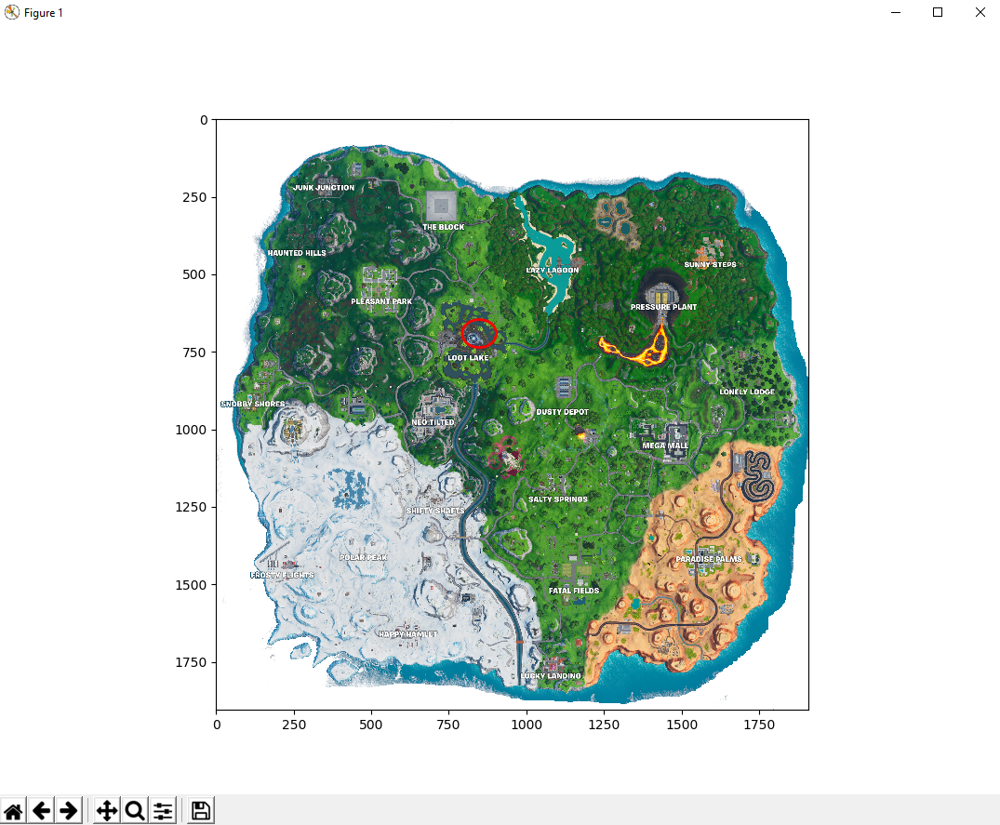

# Fortnite-Random-Drop

&nbsp;&nbsp;&nbsp;&nbsp;&nbsp;&nbsp;&nbsp;&nbsp;&nbsp;&nbsp;&nbsp;&nbsp;&nbsp;
&nbsp;&nbsp;&nbsp;&nbsp;&nbsp;&nbsp;&nbsp;&nbsp;&nbsp;&nbsp;&nbsp;&nbsp;&nbsp;


[](https://opensource.org/licenses/MIT)

<br>
Fortnite random drop generator implemented with Python using matplotlib, PIL, numpy, random

<br>

## Converting Python file to .exe
```
pyinstaller -y -w -i "ICON-PATH/icon_founders_badge_RNV_icon.ico" 
--add-data "MAP-IMAGE-PATH/map5.png";"."  
"PYTHON-PATH/FN Random Drop 2.py"
```

## Screenshot

